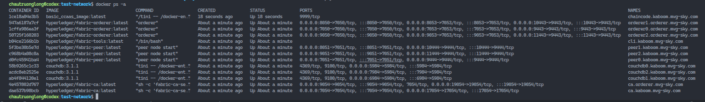

# Kaboom Fabric Score

## Documentations

- [About Author](documentations/kaboom-fabric-score/author.md)
- [About Project](documentations/kaboom-fabric-score/project-information.md)
- [About Blockchain](documentations/kaboom-fabric-score/blockchain-kaboom-fabric-score.md)
- [About WebAPI](documentations/kaboom-fabric-score/webapi-kaboom-fabric-score.md)
- [About WebApp](documentations/kaboom-fabric-score/webapp-kaboom-fabric-sorce.md)

## Development Tools

- IDE:
  - [IntelliJ IDEA](https://www.jetbrains.com/idea/download/#section=linux)
  - [Visual Studio Code](https://code.visualstudio.com/download)
- API Testing:
  - [Postman](https://www.postman.com/downloads/)
- Source Control GUI:
  - [GitKraken](https://www.gitkraken.com/)
- Design Diagrams Tools:
  - [Drawio Desktop](https://github.com/jgraph/drawio-desktop)
- Notes & Read Documentations:
  - [Obsidian](https://obsidian.md/download)

## System Architecture

## Run Project

>### Run Blockchain Network

- Move to network directory

```bash
chautruonglong@codex:kaboom-fabric-score$ cd ./blockchain/kaboom-network
chautruonglong@codex:kaboom-network$ ls
channels  command.txt  dist  explorer  install-fabric.sh  LICENSE  network.png  network.sh  organizations  run.sh  scripts
```

- Run by one command

```bash
chautruonglong@codex:kaboom-network$ cd ./run.sh
```

- After startup network



>### Run WebApp Front-end

- Move to network directory

```bash
chautruonglong@codex:kaboom-fabric-score$ cd ./webapp
chautruonglong@codex:webapp$ ls
babel.config.js   jsconfig.json   package.json   postcss.config.js  ' .prettierignore'   public   src   themeConfig.js   vue.config.js   yarn.lock
```

- Install packages

```bash
chautruonglong@codex:webapp$ yarn install
```

- Startup application

```bash
chautruonglong@codex:webapp$ yarn serve

yarn run v1.22.19
$ vue-cli-service serve
 INFO  Starting development server...
98% after emitting CopyPlugin

 DONE  Compiled successfully in 30159ms                                                                                                                                                                                                           10:04:42 PM


  App running at:
  - Local:   http://localhost:8080/ 
  - Network: http://192.168.0.128:8080/

  Note that the development build is not optimized.
  To create a production build, run yarn build.
```

- Open application on browser


